# kvarto-files

Kvarto is a 1 vs 1 game app where players compete to place four pieces in a row on a 4x4 board to win. Pieces can be different shapes, colors, and heights, but a winning four-in-a-row only needs a single attribute in common. But there’s a twist: you pick your opponent’s piece! Kvarto includes user authentication, chat, statistics, and more. Firebase’s Realtime Database is used to keep the game interactive, along with Firebase Functions for cloud management and notifications.

### Profile screen (profile_nav.dart)
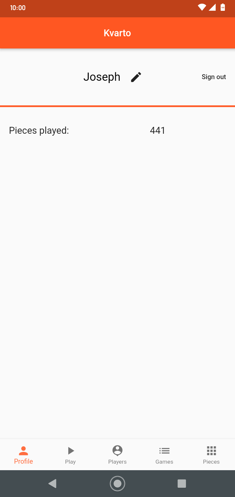

On this menu of the app, the logged-in user's statistics are shown (not many so far). The user can log out or edit their name.

### Play screen (play_nav.dart)
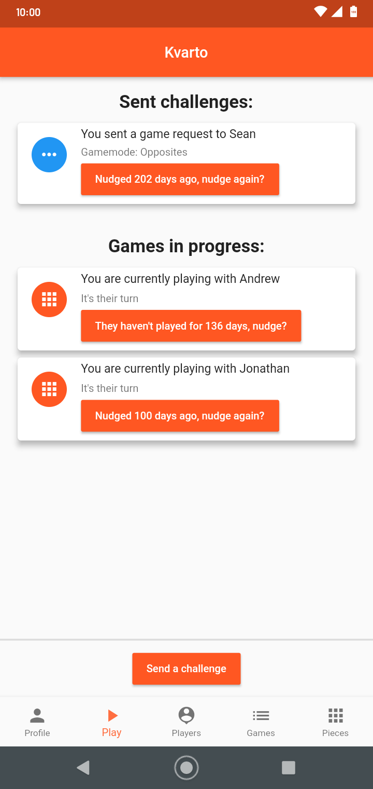

This menu allows the user to control their current games as well as start new ones (by sending a challenge). Incoming and outgoing game requests are shown along with current games. A pair of two users can only have one game with each other at a time. Players can nudge their opponent if they haven't played for a while. The nudge gives the opponent a notification on their phone. See "Challenge screen" below for the menu shown after clicking "Send a challenge."

### Players screen (player_nav.dart)
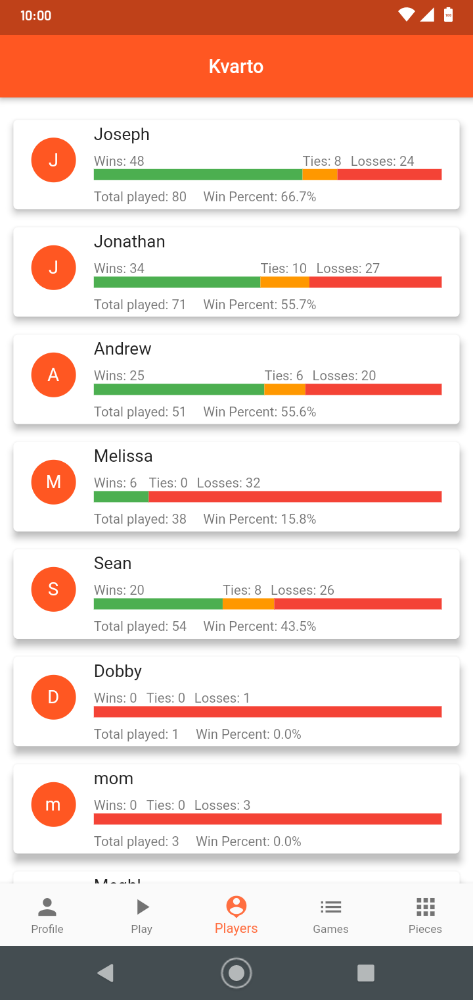

Since only me and my friends use this app, by default, all users with an account are shown on this screen. Win/loss statistics are shown with a cool visual meter.

### Games screen (games_nav.dart)
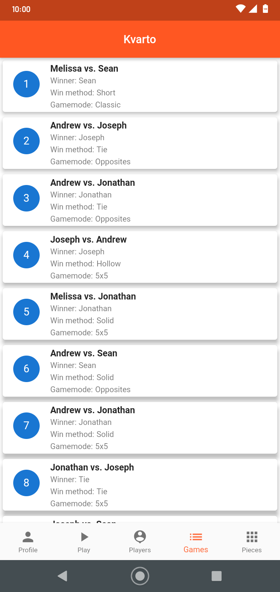

Here, all the games that have ever been played can been seen. The ending board of all games is saved, which users can see by tapping on a game. This is shown below.

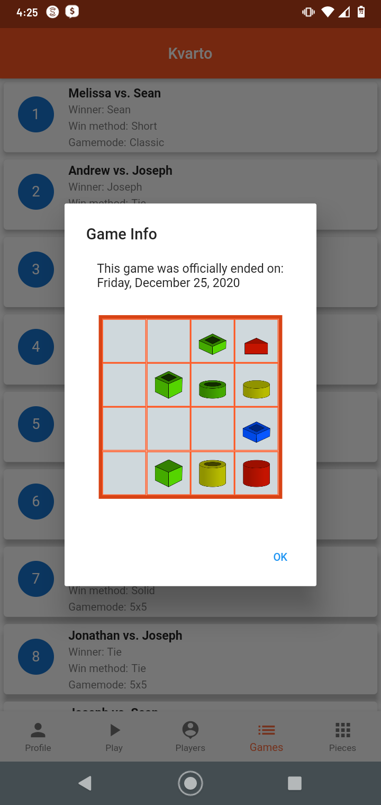

### Pieces screen (right_nav.dart)
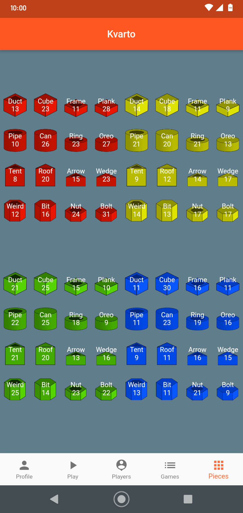

This tab was just for fun to see which pieces are selected most often.

### Challenge screen (GameRequest.dart)
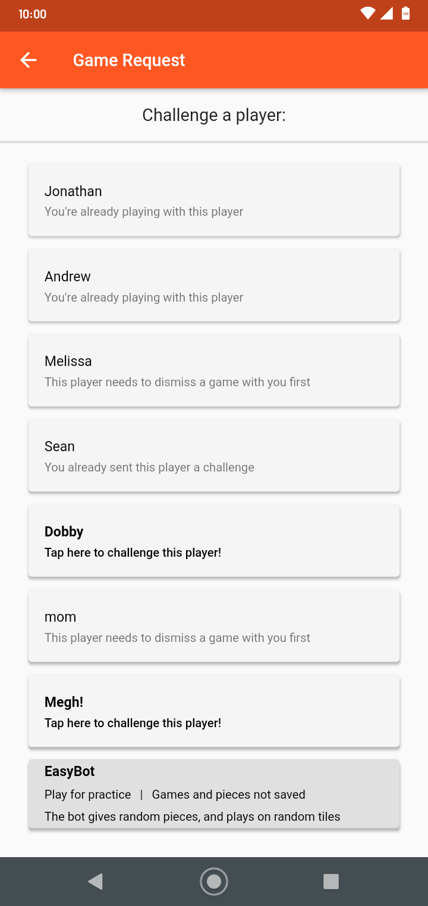

Here, the user can send a challenge to any other user of the app. A bot is available for testing the game. After selecting a user, the next screen is shown (see below). Then, the user selects a gamemode to play, provides an optional message, and sends the challenge. The other user receives a challenge notification.

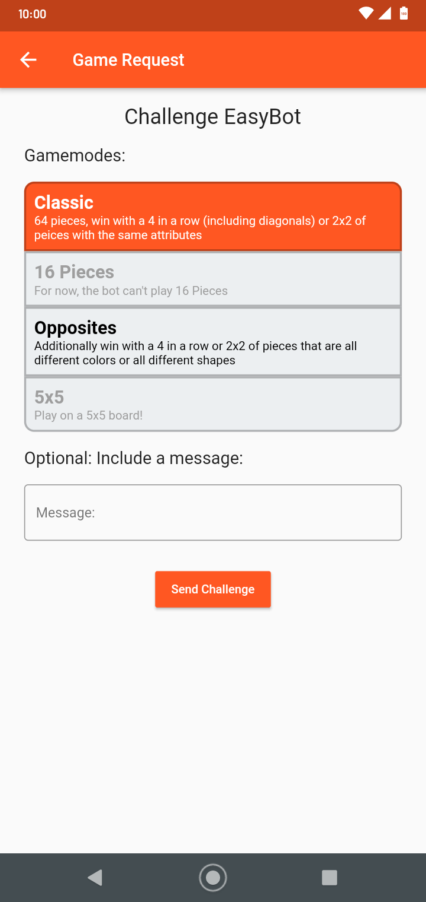

### In-game (GameView.dart)
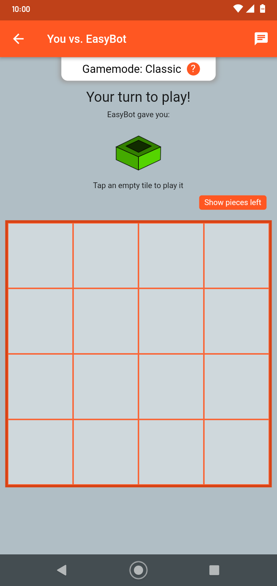

At any time, a user can click on an active game on the game tab to access the game screen. In Kvarto, there are 64 pieces all with different colors, shapes, heights, and solidities. A user wins if they can make a four-in-a-row or 2x2 where all four pieces share **at least** one attribute. You pick the other players piece, and vice versa. It doesn't matter which pieces are placed by who, just that you were person to place the fourth piece in the sequence.

This means the game follows four stages until it is over:
* Player 1 picks the opponents piece
* Player 2 plays that piece on the board
* Player 2 picks player 1's piece
* Player 1 plays that piece on the board
* (repeat)

In the game screen, the user can see the current stage of the game, the board, the opponent, the gamemode. They can also tap "Show pieces left" to see a row of all the remaining pieces. Selection of a piece is shown below.

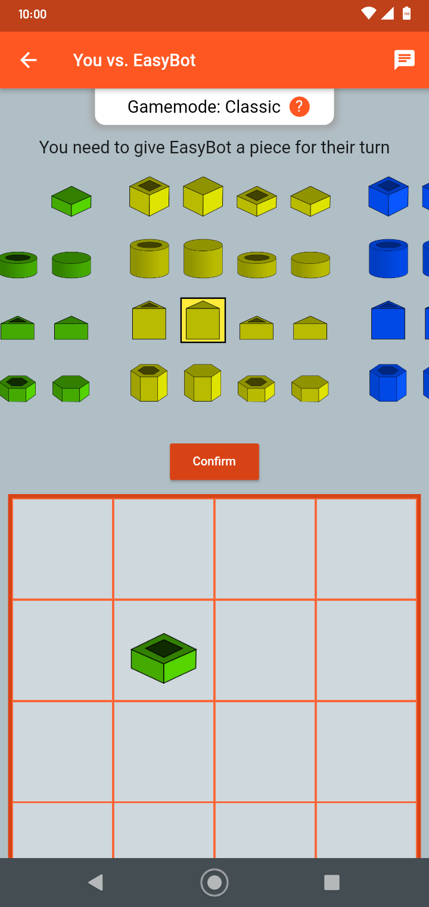

Finally, the game detects when a player has won, ends the game, and highlights the winning areas. In the screenshot below, I won by placing a hollow, green, short hexagon at the top, which won by a 2x2 of hollow pieces, as well as a four-in-a-row of short pieces.

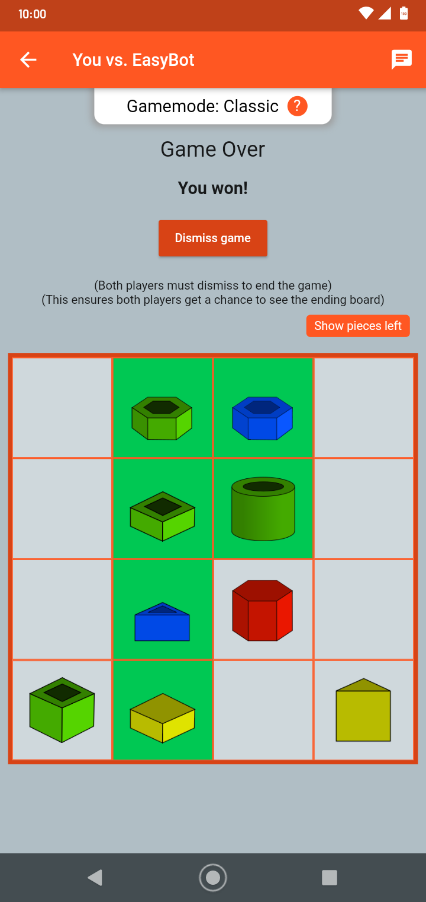

A chat is also available in-game, as shown below.

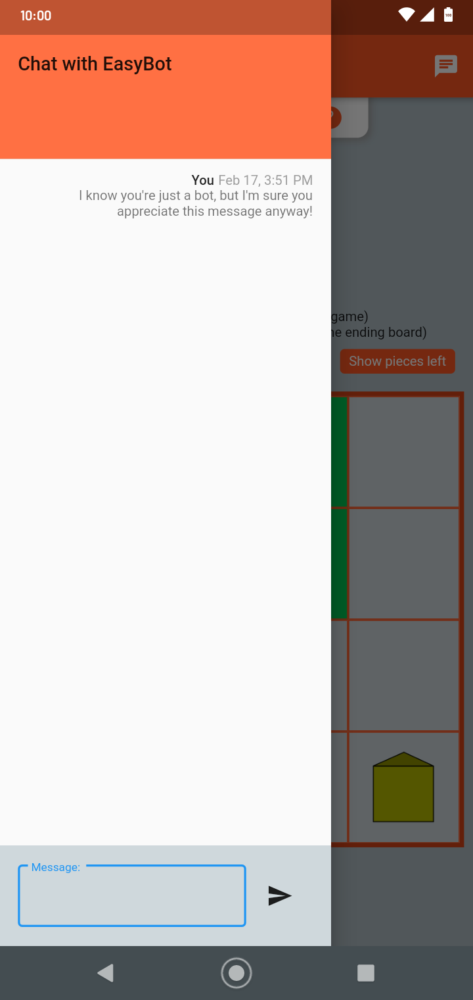
